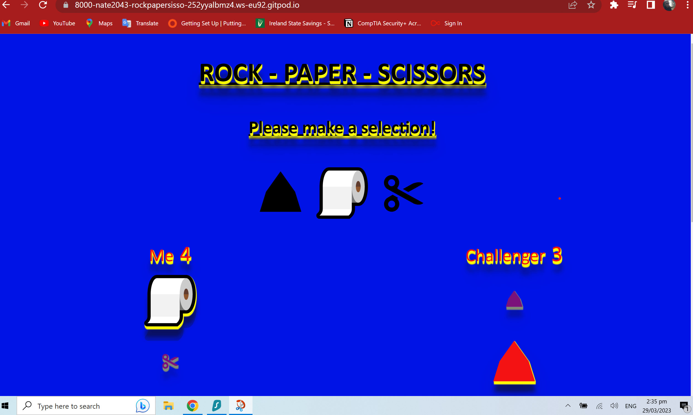

# Rock,Paper,Scissors

This game was my first attempt with JavaScript. I wanted to create a simple yet effective game, and I wanted it to be challenging enough so that you didn't lose interest quickly.

After looking at a few games that I could create with JavaScript, I liked Rock-Paper-Scissors as it seemed like a fun game to start off with, so here it is! I hope it's not too dull, but it is good fun trying to win against the computer!
This is my first JavaScript project.

I wanted to keep it simple and straight forward. You select one of the symbols for either [rock, paddle, or scissors] and the score will increment, and you can play agains the computer as long as you want; it will reset once you refresh the screen.

The game consists of
HTML,
JavaScript,
CSS
which is one page with no menus or pop-ups,
With the basics, I made this game colorful yet simple.## Acknowledgements

I watched the YouTube channel for help on how to make the JavaScript work using the correct functions. https://www.youtube.com/watch?v=1yS-JV4fWqY His name is Kyle, and his YouTube channel is https://www.youtube.com/user/WebDevSimplified. He made it a lot easier to understand the functions and what they do to make my game work, including incrementing the score and making the number change as the game goes on. It was very helpful, and I can't thank him enough for explaining the process in a way that is very simple for beginners.

The goal of this game is functionality for my first attempt with JavaScript.
The game is suitable for all ages and is very user-friendly.

## Features

The name of the game is Rock, Paper, Scissors and is at the top of the page.

Below this is a h2 with the phrase please make a selection. Below that are the 3 symbols for the game (Rock), which was a simple emoji copied over from the keyboard, as was the scissors emoji, and the paper was an emoji of a toilet paper that I added in for humour.

I wanted the emojis to pop just for some added effect and to make it obvious which selection you were making!

The game itself will calculate the scores based on your choices and will continue until the screen is refreshed.
You will also be able to review your choices and the computer's choices by scrolling down to see what was selected in the previous moves of the current game.

I used simple emojis that I found on my keyboard, which I just copied and pasted into the HTML section.

## Running Tests

I tested the game with the following:
I used Lighthouse for the first test.
checking the 
performance = 100%
accessability = 100%
Best practices = 100%
SEO = 91%.

To test my CSS, I used the W3C CSS Validator (https://jigsaw.w3.org/css-validator/), and it showed no errors.

Once I discovered the CSS wasn't working correctly, I began to repair my code.
I had some errors show up on the text shadow part, such as missing semicolons and some missing commas in my text shadow section, so I replaced them with the correct syntax, and the CSS stopped showing the red underlined markers for errors with my code!
Once I added the missing semicolon and the spell check and edited the amount of shadowing, it turned green in my editor, and then I checked it in my deployed project site.

I then checked my HTML by using the W3C HTML Validator (https://validator.w3.org/), and that showed no errors.

I then checked if my game was responsive, and all screen sizes showed no issues.
I went to the site called Am I Responsive (https://ui.dev/amiresponsive) online, and it showed me all of the screen sizes.

I used js hint ( https://jshint.com/ ) to check my java script, and that showed up like 36 problems; I wasn't sure how to repair them, so I had to contact student care, as I had never used java script before, and it was so alien to me that I had to Google some answers; I didn't know what to search for to make the repairs. So once student care came back to me, it turned out to be a few minor errors with missing semi-colons that I didn't realise needed to be the same in Javascript, but I will remember that from now on, and there were some spelling mistakes that turned up and were repaired. I had spelled the word challenger wrong, but once it was pointed out to me, it was repaired straight away.

## UX

I decided to make this game look old school and simple with a basic color scheme of blue, black, red, and just a hit of yellow,
I tried to add in some 3D effects on the lettering to give it that old school arcade game look that I grew up with.
I made it so the symbols pop up when they are hovered over, so it's a little more interactive.
The name is at the top of the screen, and the next heading down is the h2. Please make a selection, and I underlined them both to give it some structure. I then added the symbols under that, and then the sections for ME and Challenger with the score counter beside them for ease of keeping pace on the game.
Once you begin the game by selecting the symbol you want to start with, the selected symbols will appear below the I symbol, and so will the challenger's choice below the computer's choice.
You will also be able to scroll down the page, review your selections, and match your winners next to the scores above, which should increment with every choice.

## Colour

I chose the background color of rgb(0, 19, 231),
because it looks like the old school Super Mario game blue, and I added in some text shadow and used some rgb(245,18,18) (red) with some yellow to make it stand out, and I tried to give it that 3D effect by adding some layers to this and using text shadow, which gave a nice border around the symbols.

## Font Family

I used this font (Gill Sans', 'Gill Sans MT', Calibri, 'Trebuchet MS', sans-serif),
as I liked the look of it.## User

As a user, I want you to enjoy the game and have a challenge trying to beat it, so it's set to randomize the outcome so it will be fun and not very predictable.

I made it so the score will increment based on the choices.
and the score will indicate the winner at the top once the player decides to finish. The choices will continue down the page.
so you can go back and see how your choices match up with the scores at the top.

[def]: docs/homepage.png